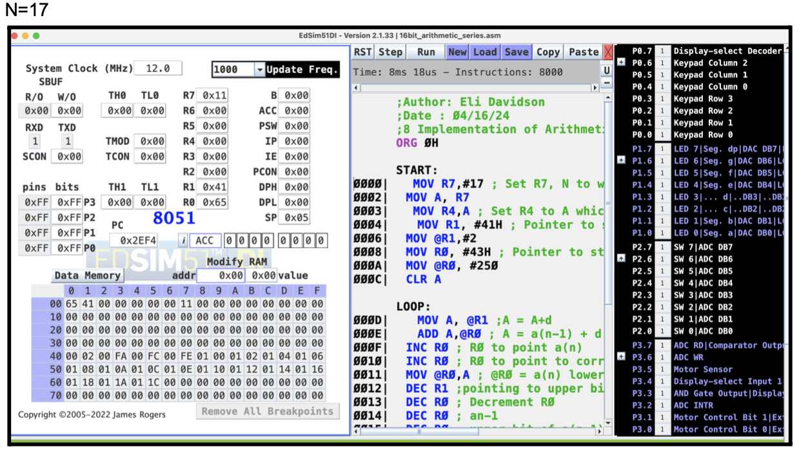
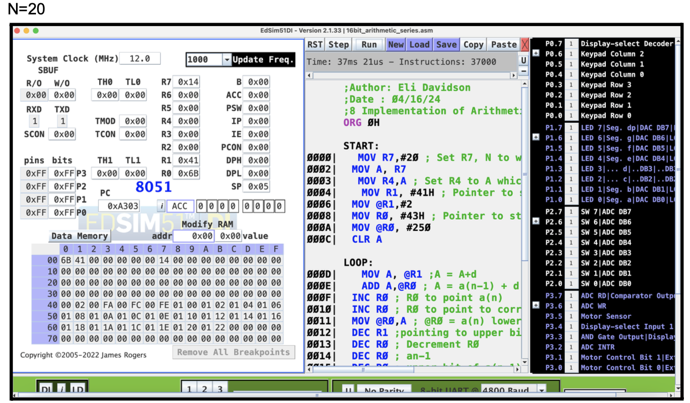

# Author
Eli Davidson
# contact
elid@uci.edu

# Description

The arithmetic sequence is defined as follows: 
an = a1 + (n − 1) ∗ d  
A recursive formulation is defined as follows: 
an = an−1 + d 
Write a subroutine that generates the first N elements of an arithmetic sequence following its recursive formulation and stores them in the memory. For your implementation, assume the common difference d = 2 and the first term a0 = 1. The length of sequence or N should be read directly from R7, the common difference d should be read from address 0x50 and have a pointer to this address stored in  R1, and the output should be stored in the memory, starting from address 0x51H. To generate the Nth sequence, your code should read the N − 1th element from the corresponding memory location. You can assume that 1 < N < 127, that means you will only need 8 bit to store the output. Make sure the first element a0 of the sequence is pre-programmed in memory address 0x51H.
should be stored in a single array as follows: a,b,c,d.

# Test Case
Case1: a=02, b=12, c=15, d=03  
EXPECTED OUTPUT: 50H=00H , 51H=45H (2*12+15*3 = 69 which is 45H in hex system)  

Case2: a=40, b=07, c=36, d=10   
EXPECTED OUTPUT: 50H=02H, 51H=80H (40*07+36*10 = 640 which is 280H in hex system)

# Results

