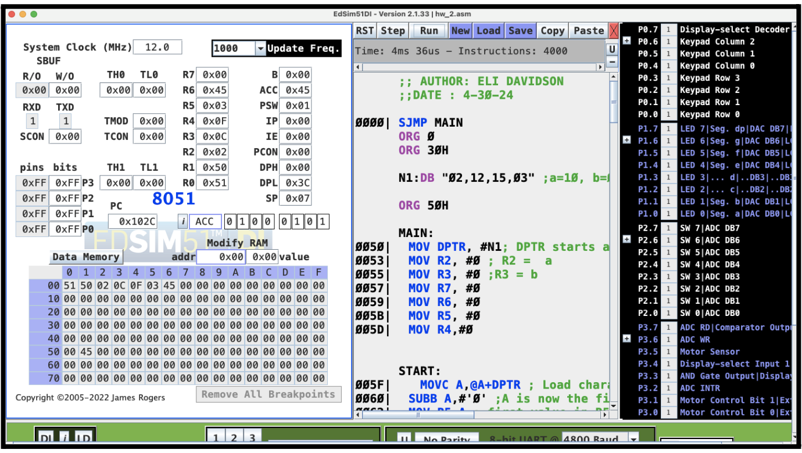
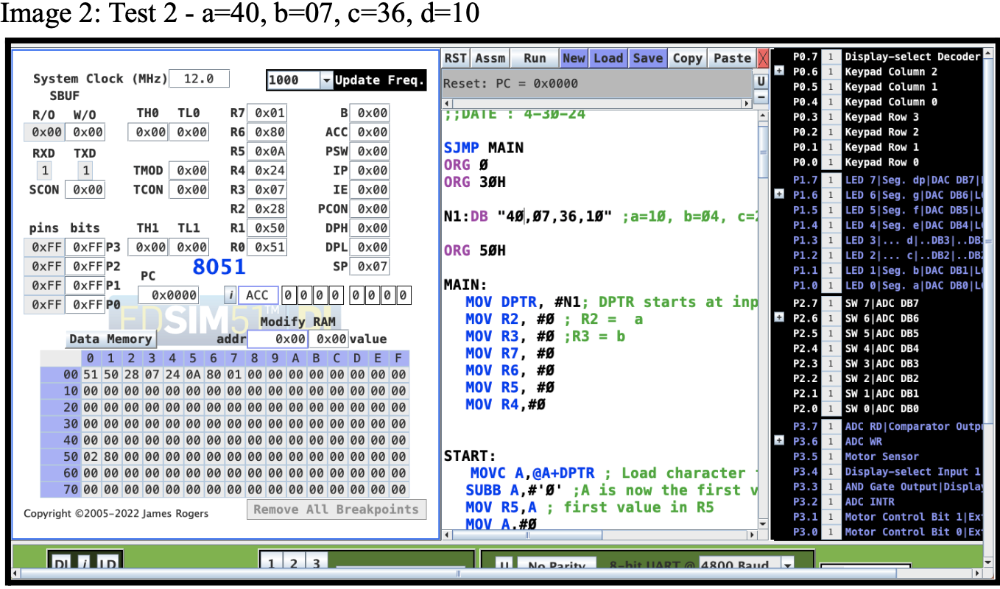

# Author
Eli Davidson
# contact
elid@uci.edu

# Description

Given a 2x2 matrix  
a b  
c d  

where each element is an 8-bit number, you are required to write a program
that computes the sum of products of the elements in each row, i.e. find (a*b)+(c*d) and store the result in the memory. The matrix should be added in code memory starting from location 30H as strings
in ASCII format. To make the computations easier, the elements of the 2x2 matrix
a b  
c d 

should be stored in a single array as follows: a,b,c,d.

# Test Case
Case1: a=02, b=12, c=15, d=03  
EXPECTED OUTPUT: 50H=00H , 51H=45H (2*12+15*3 = 69 which is 45H in hex system)  

Case2: a=40, b=07, c=36, d=10   
EXPECTED OUTPUT: 50H=02H, 51H=80H (40*07+36*10 = 640 which is 280H in hex system)

# Results

